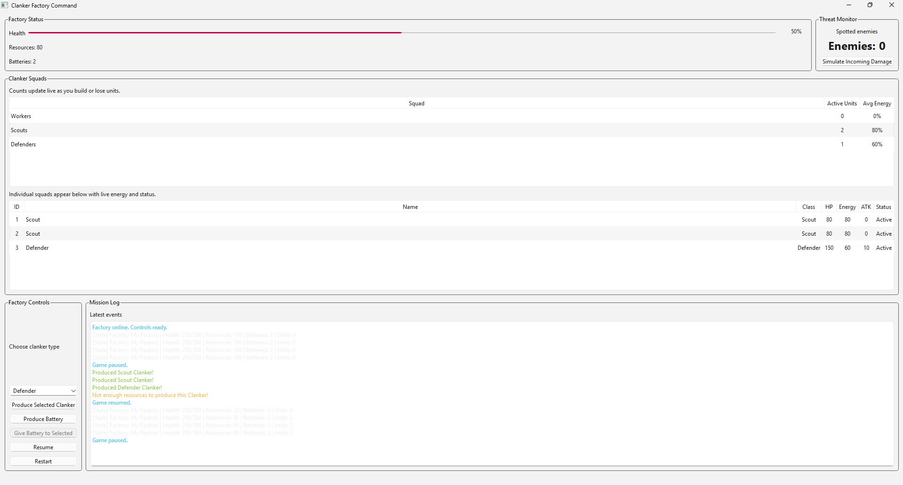

# ClankerFactory

*A C++/Qt factory management simulation where you produce and manage robotic units (Clankers) to gather resources, repair your factory, and defend against enemy attacks.*

## Overview

ClankerFactory is a Qt-based simulation game where you manage a factory that produces three types of robotic units called "Clankers". Each unit type has specific abilities and energy requirements. Your goal is to balance resource production, factory repairs, and defense to keep your factory operational.

## Game Mechanics

### Clanker Types

* **Workers**: Consume 5 energy per action. Can either repair the factory (costs 10 resources, heals 15 HP) or gather 5 resources.
* **Scouts**: Consume 5 energy per action. Gather 10 resources efficiently.
* **Defenders**: Consume 10 energy per action. Automatically engage enemies that threaten the factory.

### Production Costs

* Worker: 20 resources
* Scout: 30 resources
* Defender: 40 resources
* Battery: 15 resources (recharges 1 clanker)

### Core Systems

* **Energy Management**: All clankers require energy to perform actions. Use batteries to recharge them.
* **Resources**: Gathered by Workers and Scouts, used to produce new clankers and batteries.
* **Factory Health**: Starts at 250 HP (max 500). Workers can repair damage when resources are available.
* **Enemy Waves**: Hostile units spawn every 7 seconds and attack your factory. Each enemy has HP and attack power.
* **Combat**: Defenders automatically engage nearby enemies. If enemies aren't eliminated, they damage your factory. Game over occurs when factory health reaches 0.

## Controls & UI

* **Production Panel**: Select clanker type and click "Produce Clanker" to create new units.
* **Battery System**: Click "Produce Battery" to create batteries, then select a clanker and click "Give Battery" to recharge it.
* **Squad Overview**: View active units per type and average energy levels.
* **Detail Table**: See complete status of each clanker (ID, name, class, HP, energy, attack, status).
* **Factory Health Bar**: Monitor your factory's structural integrity.
* **Log Panel**: Real-time color-coded event feed showing all factory activities.

## Strategy Tips

* Workers can repair OR gather resources - they automatically repair if resources ≥10 and factory health is below max.
* Scouts are more efficient at gathering (10 vs 5 resources per action) but cost more to produce.
* Defenders consume more energy but are essential for survival.
* Balance your clanker roster based on current needs (gathering, repairing, or defending).
* Keep batteries in stock to recharge units before they run out of energy.

## Requirements

* Qt framework (Qt 6.x recommended).

## How to Build and Run

See [HowToStartUpGame.md](Docs/HowToStartUpGame.md) for detailed instructions on downloading, setting up Qt Creator, building, and playing the game.

## Project Requirements Checklist

This project fulfills the following C++ and OOP course requirements:

### Basis

- ✅ **Useful and correct class**: `Clanker` class represents all unit types with shared behavior (health, energy management). This abstraction avoids code duplication.
- ✅ **Useful and correct abstraction**: The `Clanker` base class abstracts common properties (health, energy) while derived classes add specific behaviors.
- ✅ **Useful and correct encapsulation**: All member variables are private/protected with public getters/setters, preventing direct manipulation.
- ✅ **Useful and correct inheritance**: `Worker`, `Scout`, and `Defender` all inherit from `Clanker`, reusing common functionality.
- ✅ **Useful and correct polymorphism**: Virtual function `work()` allows different behaviors per unit type at runtime.
- ✅ **Useful and correct object composition**: `Factory` class contains collections of `Clanker` objects, managing their lifecycle.
- ✅ **Useful and correct base class**: `Clanker` serves as the foundation for all unit types.
- ✅ **Useful and correct abstract base class**: `Clanker` has pure virtual function `work()` making it abstract.
- ✅ **Useful and correct virtual function**: `work()` method is virtual for polymorphic behavior.
- ✅ **No mistake in object-oriented programming**: Proper use of inheritance hierarchy, no slicing, correct destructor chain.

### Aanvullend

#### Algemeen
- ✅ **Clean main**: Main only initializes Qt application and window; all logic is in classes.
- ✅ **No globals, but statics if needed**: No global variables; static members used where appropriate.
- ✅ **Correct protections**: Private, protected, and public access specifiers used correctly.
- ✅ **Maintainability**: Consistent naming conventions, comments, and code style throughout.
- ✅ **Separate header files**: Each class has its own `.h` and `.cpp` file.
- ✅ **One complete project that compiles**: CMakeLists.txt builds the entire project without errors.
- ✅ **Fully working project**: Game runs with complete mechanics (production, combat, resource management).
- ✅ **Sufficient git commits**: Regular commits throughout development.
- ✅ **Correct files on git**: All source files, assets, and documentation included.
- ✅ **Working build manual**: See [HowToStartUpGame.md](Docs/HowToStartUpGame.md) for complete build instructions.

#### OOP
- ✅ **At least 2 default constructors**: Multiple classes have default constructors.
- ✅ **At least 2 parameterized constructors**: Unit classes accept name and id parameters.
- ✅ **At least 2 copy constructors**: Implemented for classes that need deep copying.
- ✅ **At least 2 destructors**: Each class properly cleans up resources.
- ✅ **Member initialization in constructors**: Constructor initializer lists used throughout.
- ✅ **Constructor forwarding**: Delegating constructors implemented where appropriate.
- ✅ **Useful proven (dynamic) polymorphism**: Virtual functions called on base class pointers/references.
- ✅ **Useful usage of "this"**: Used in member functions to disambiguate and return self-reference.
- ✅ **Useful member function**: Methods like `takeDamage()`, `recharge()`, `doWork()` encapsulate behavior.
- ✅ **Default values in function definition**: Functions have default parameter values where applicable.
- ✅ **Useful member variable**: Each class has relevant state (health, energy, name, id, etc.).
- ✅ **Useful getters and setters**: Controlled access to member variables via accessor methods.
- ✅ **Correct usage of inline function**: Small frequently-called functions marked inline.
- ✅ **Useful template function or class**: Template function `produceUnit<UnitType>()` for generic unit production.
- ✅ **Useful friend function or class**: Used for operator overloading and controlled access.

#### C++
- ✅ **Everything in one or more self-made namespace(s)**: Code organized in namespaces.
- ✅ **2 useful unsigned chars or other memory efficient types**: Used for small integer values (counts, states).
- ✅ **At least 4 useful const references for variables**: Const references used in function parameters to avoid copying.
- ✅ **At least 4 useful const references for functions**: Const member functions that don't modify state.
- ✅ **At least 4 useful bool**: Boolean flags for state management (alive, loggingEnabled, destroyed, inactive).
- ✅ **Dynamic memory allocation (new)**: Objects dynamically allocated as needed.
- ✅ **Dynamic memory removing (delete)**: Proper cleanup in destructors.
- ✅ **2 useful (modern) call-by-references**: Modern reference parameters used throughout.
- ✅ **Useful string class usage**: QString and std::string for text handling.
- ✅ **Useful container class**: std::vector for managing collections (units, enemies, messages).
- ✅ **Useful usage of nullptr**: Modern null pointer literal instead of NULL.
- ✅ **Useful usage of (modern) file-I/O**: std::ofstream used for logging factory state.
- ✅ **Useful usage of lambda function**: Lambdas used for color-coding, item creation, and filtering.
- ✅ **Useful usage of std::async**: std::async used for asynchronous salvage scanning.

### Uitbreiding
- ✅ **Useful Qt class**: Multiple Qt classes (QMainWindow, QWidget, QPushButton, etc.).
- ✅ **Useful usage of signals/slots**: Qt signal/slot mechanism for UI interaction and event handling.
- ✅ **Test-driven development**: Comprehensive test plan documented in [TestPlan.md](Docs/TestPlan.md) covering all major features.
- ❌ **Solve bug ticket**
- ❌ **Report a bug ticket on another project**
- ✅ **Usage of a GUI**: Complete Qt-based graphical user interface.
- ❌ **Usage of OpenGL or other 3D engine**
- ✅ **Useful usage of an external library**: Qt framework extensively used (QMainWindow, QTimer, QTableWidget, signals/slots).
- ❌ **Project that communicates with hardware**
- ✅ **Nice extra**: color-coded HTML logging (dynamic color-coding with lambda functions) 
